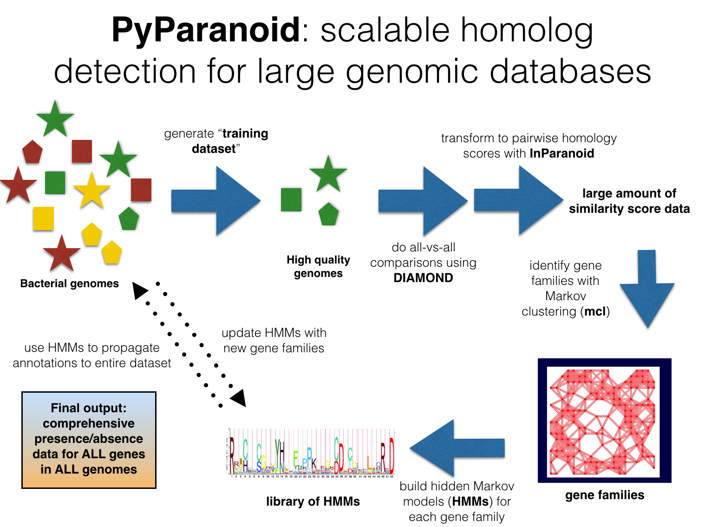

# PyParanoid

**Ryan Melnyk**  
**[Haney Lab - University of British Columbia](https://haneylab.msl.ubc.ca/)**  
**v0.2.1 - release December 13, 2017**

***ryan.melnyk@msl.ubc.ca***  
***schmelnyk@gmail.com***



PyParanoid is a pipeline for rapid identification of homologous gene families in a set of genomes - a central task of any comparative genomics analysis. The "gold standard" for identifying homologs is to use reciprocal best hits (RBHs) which depends on performing a all-vs-all sequence comparison, usually using BLAST, to determine homology.  However, these methods are computationally expensive, requiring **O(n<sup>2</sup>)** resources to identify RBHs. This is problematic, as the modern deluge of sequencing data means that comparative genomics analyses could be performed on datasets of thousands of strains.

To circumvent this obstacle, I developed a two-step machine learning-inspired pipeline which develops gene models for the pangenome of a training dataset and then propagates those models to additional strains (the "test dataset").  The first step identifies homologs using conventional **O(n<sup>2</sup>)** RBH-based methods but relies on the recent sequence alignment program [DIAMOND](http://github.com/bbuchfink/diamond) to speed up this process by an order of magnitude over BLAST-based methods.  The second step uses the gene models generated in the first step to propagate annotations to additional strains using **O(n)** resources. I named this pipeline PyParanoid as it is written in Python and relies on the pairwise homology algorithm [InParanoid](http://inparanoid.sbc.su.se/cgi-bin/faq.cgi). Using this pipeline, it is possible to generate homology-based annotations for thousands of bacterial and archaeal genomes in hours on a local machine.

I have also included some methods that facilitate upstream genome database management as well as downstream comparative genomics workflows using the PyParanoid database, such as synteny analysis and homology-based visualizations of genomes.

## Installation

PyParanoid is primarily written in python.  To manage python installations and environments, I highly recommend using [Miniconda](https://conda.io/miniconda.html).

PyParanoid also depends on a modified version of the InParanoid script ([Sonnhammer et al., 2015](http://inparanoid.sbc.su.se/cgi-bin/faq.cgi)) and thus also requires perl to be installed. Pretty much any version should work.

PyParanoid can be installed using pip simply by running

```bash
pip install pyparanoid
```

I do most of my work in MAC OS X so I will notate shortcuts when relevant.

#### Using Homebrew :beer::beers::beers::beer:

OSX users can install these dependencies easily using [Homebrew](https://brew.sh/) and running the following commands.

```
brew tap homebrew/science
brew install diamond
brew install hmmer
brew install mcl
brew install cd-hit
brew install muscle
```

Make sure that these are all located in your PATH (and that all of the executables work!)

#### Manual installation

If Homebrew doesn't work or you aren't in OSX, you will have to install the dependencies manually. Please ensure that all executables are located in a folder accessible in your $PATH.

###### DIAMOND
See http://github.com/bbuchfink/diamond for details.  Linux users can download an executable [here](https://github.com/bbuchfink/diamond/releases).

###### HMMER
http://hmmer.org/download.html - Download the newest version for your operating system.  PyParanoid should work with HMMER2 and HMMER3.

###### mcl
mcl can be found [here](https://www.micans.org/mcl/index.html?sec_software).

###### cd-hit
CD-hit can be found [here](http://weizhongli-lab.org/cd-hit/)

###### muscle
muscle can be found [here](http://www.drive5.com/muscle/)

## Running PyParanoid


#### Input

At minimum, you can run PyParanoid using just a folder of FASTA-formatted amino acid files of indiscriminate provenance.  These should be named with the format ```strain_name.pep.fa``` file extension and stored in a folder named ```pep```.  The "genomedb" argument for ```BuildGroups.py``` and all other scripts should point to the relative location of the folder containing ```pep```. All ```strain_name``` fields should be unique since this is the primary way that PyParanoid categorizes the strains. Underscores, letters and numbers are permitted which is generally what NCBI does when sanitizing strain names for filenames (i.e. Pseudomonas fluorescens Pf-5 becomes ```pseudomonas_fluorescens_pf_5```).  Additionally, within each strain's amino acid FASTA file file sequence IDs should be unique.

Alternatively, you can use some of the methods in the genomedb module within PyParanoid. This Check out the ```BuildGenomeDatabase.ipynb``` notebook for details.

PyParanoid also requires a ```strainlist.txt``` which should be a text file containing the names of the strains to include in the analysis, one per line.  These should match up with the prefixes of the amino-acid FASTA files in the ```pep``` folder.

#### Input vs output

Generally the way I use PyParanoid is to build a pangenome using only high-quality reference genomes.  This is primarily because draft genomes in many contigs frequently have split, truncated, or missing genes due to assembly breakpoints.  Once the pangenome is built, these draft genomes can be added to the database.  Importantly, they can be added incrementallyas new sequences become available.

As an example, I built gene models for ~200 Pseudomonas strains in late 2016 and then annotated >3600 more genomes since then using those models.  To add additional genomes now, I simply propagate the gene families to the new genomes rather than redoing the entire workflow.

Of course, this is a tradeoff between computational time and detecting novel gene families.  Obviously, it depends on the phylogenetic distribution or the training dataset vs. the test dataset.  If you used a training set of hundreds of genomes that are broadly distributed across a genus or family, you will have better luck propagating those gene families than if you use only a few dozen strains from a single species as the training dataset and then use those gene families on a test dataset containg genomes from a different genus or family. A good example of how to be confident in the phylogenetic scope of the training and test datasets can be found in the PyParanoid manuscript.

 I am planning to address this issue in future development by adding an option to add new gene families as new strains get added to an existing database.

## Quick start guide

```bash
## Run PyParanoid to generate homology calls and models
BuildGroups.py --clean --verbose --use_MP  --cpus 8 pfl_genomeDB strainlist.txt pfl_pyp

## Propagate groups to new draft genomes
PropagateGroups.py pfl_genomeDB prop_strainlist.txt pfl_pyp

## Because the database is persistent you can add new genomes whenever you want.
PropagateGroups.py new_genomes new_genome_list.txt pfl_pyp
```

###### Pull out orthologs

This command pulls out orthologs from the "pfl_pyp" database generated in the previous section. As this dataset includes many draft genomes with missing or fragmented genes, specifying a threshold is a good idea. ```--threshold 0.95``` will find genes present as a single copy in over 95% of all strains. If no threshold is specified, orthologs will be "strict" (i.e. present as a single copy in every strain).

```bash
IdentifyOrthologs.py --threshold 0.95 pfl_pyp pfl_ortho
```

This produces a file ```master_alignment.faa``` which can be used to generate a species tree using your method of choice. (I like FastTree and RAxML!)

## Analysis examples

I've included a few iPython notebooks detailing some relatively simple analyses you can do using only three ingredients: the presence/absence matrices generated by PyParanoid, a species tree, and genbank files for specific strains of interest.

Check them out in the ```analysis_ipython``` folder.  They all depend on my local Pseudomonas PyParanoid database which is too massive to share easily. Just adapt the path arguments to the relevant folders for your PyParanoid project.


## Citing PyParanoid

if you're reading this I'm still working on a manuscript containing PyParanoid so just cite this github page.
